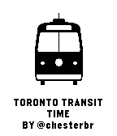
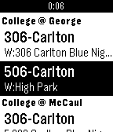
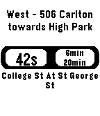
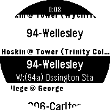
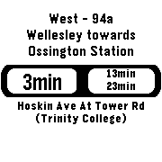

# Toronto Transit Time

A [Pebble](https://repebble.com/) application that shows bus/streetcar arrival time predictions for nearby stops in Toronto. Originally built in 2016, it builds and runs on the modern [rePebble](https://repebble.com/) SDK.

 &nbsp;  &nbsp; 

It supports all Pebble models — including the new Pebble 2 Duo and Pebble Round/Round 2:

 &nbsp; 

### Building

You'll need the [rePebble SDK](https://developer.repebble.com/sdk):

```bash
brew install node && brew install uv
uv tool install pebble-tool --python 3.13
pebble sdk install latest
```

Then build and run in the emulator:

```bash
cd app
pebble build
pebble install --emulator basalt
```

### Rationale and Development Process

This [blog post](https://chester.me/archives/2016/12/building-a-pebble-app-with-c-javascript-and-rails-toronto-transit-time/) is a deep dive on how the initial idea ended in this app, and on why things were done in this particular way.

### Structure

The [/app](app/) directory contains:

- The C code of the main application that runs on Pebble (with separate files for the routes and predictions windows and layers, plus a splash screen layer that is shared among them).
- The JavaScript code that runs on the phone and provides location and internet API request/parsing services to the C app.

The [/server](server/) directory contains a Rails app that:
- Pre-fetches the stops from the TTC system.
- Exposes an endpoint that receives a pair of coordinates and returns the closest stops and the routes served by each of those stops.

That back-end is used only to get the routes/stops list. Check [its README](server/README.md) for setup informaiton.

Predictions and service messages are gathered directly from the TTC back-end by the watch (from the C app, via the JavaScript app).

### Credits / Acknowledgements

- [@cabello](https://github.com/cabello) for the JavaScript tips and contributions.
- [@bwinton](https://github.com/bwinton) for the color icons.

### Also thank you...

- [@bani](https://github.com/bani) for help with images, app name and Pebble development resources (not to mention having a physical Pebble Time Round, which forced me to support it 😭).
- People on the pebbledev Slack for general guidance on my first Pebble app.
- [Toronto Transit Comission (TTC)](https://www.ttc.ca/), for offering a service I am pleased to use, and for publishing the APIs that made this application possible.

### Legal

The stop locations and predictions come from the TTC Real-Time Next Arrival service. The app or its authors do not have or claim to have any affiliation with the [Toronto Transit Commission (TTC)](https://www.ttc.ca/).
